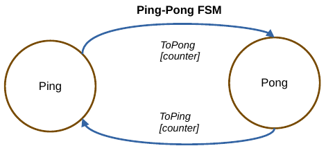
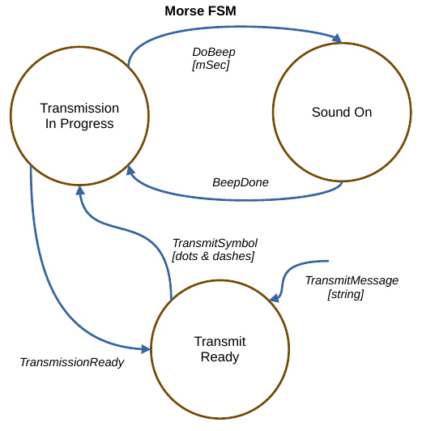
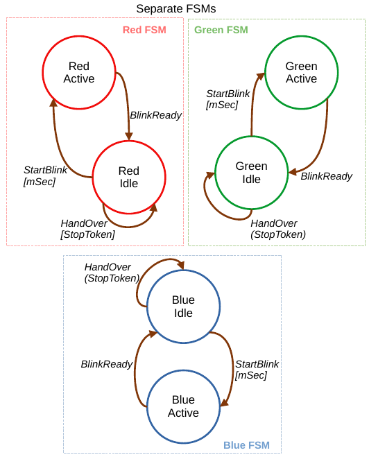
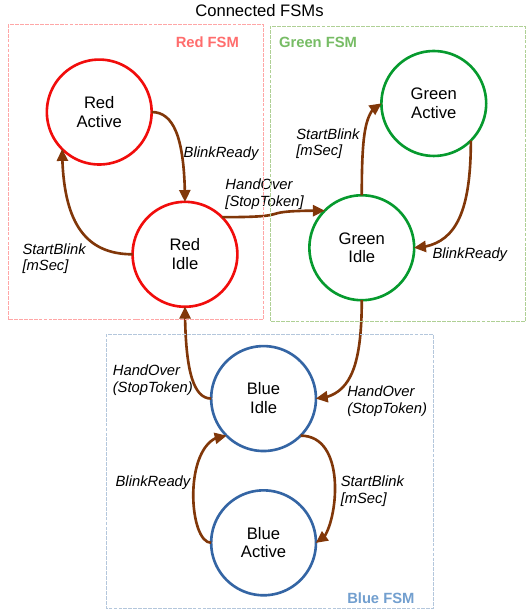
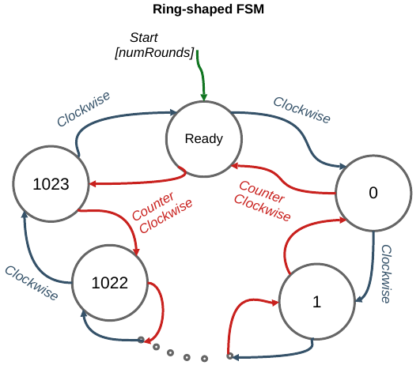

    
    
    
    

# co_fsm - a finite state machine library based on coroutine symmetric transfer
co_fsm is a C++20 header-only finite state machine library.
The states are represented as coroutines which `co_await` for events.
This makes it possible to do things like:
- Suspend the execution of FSM and later resume either from the state where it left off when it was suspended, or from another other state;
- Make changes to the transition table during the life-time of the FSM object;
- Programmatically create arbitrarily many states and arbitrarily large transition tables without manual configuration;
- Connect and disconnect FSMs living in separate source files without having to recompile everything. So a state in one FSM can send an event to a state in another FSM;
- Suspend the execution of the FSM in one thread and resume in another thread.

Events are light-weight objects consisting of a name and an optional data buffer.
Neither the states nor the events need to be inherited from a common base class.

The library uses [symmetric transfer](https://lewissbaker.github.io/2020/05/11/understanding_symmetric_transfer)
in transiting from one state to another. This makes the transitions quite fast.

It is often difficult to track the transition pattern in a complicated FSM. Symmetric transfer makes it easy to inject logger code into the transfer point where the control is handed over from one state to another to track sequence of events _("State A at time T sent event E which was received by state B")_. This is demonstrated in the examples below.

Coroutines generally use heap to store the local variables and other stuff for internal book keeping. Heap allocations take place only when the FSM is being configured.
During the running of the state machine, the library does not allocate or free memory (unless the business logic within the state coroutine does so.)

## Disclaimer
This library is a derivate work based on [tirimatangi/CoFSM](https://github.com/tirimatangi/CoFSM).
The main differences compared to the original library are:
- simplified the architecture allowing a higher flexibility to implement events;
- changed the identification of events from text (string) to numeric id;
- the automaton allows the customization of "state handle - event id" pair and their hashing;
- changed the coding style to standard-library like coding style;
- adapted examples.

## Examples

### Example 1: Ping-pong

Runnable code can be found in folder [example/ping-pong](example/ping-pong).

### Example 2: Morse code transmitter

Runnable code can be found in folder [example/morse](example/morse).

### Examplel 3: RGB - Connect and separate FSMs running in separate threads in runtime

Runnable code can be found in folder [example/rgb](example/rgb).

### Example 4: Ring - Configure an FSM programmatically and measure the speed of execution

Runnable code and makefile can be found in folder [example/ring](example/ring).

## On Exceptions
If something goes wrong, a `std::runtime_error(message)` is thrown. The message tells what the problem was. If you catch this exception while debugging, the message can be accessed with [what()](https://en.cppreference.com/w/cpp/error/exception/what).

No other types of exceptions are thrown.

## Compiler Versions
The examples have been tested with clang 16, gcc 11, gcc 12 and msvc 14.
